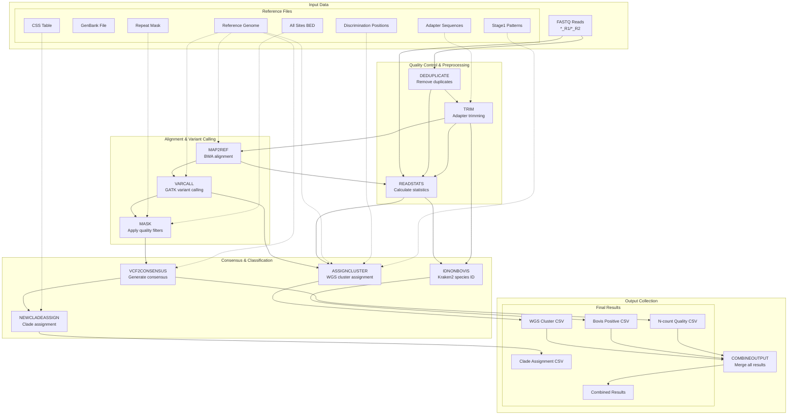

# **btb-seq**

 [](https://github.com/APHA-CSU/btb-seq/actions)

`btb-seq` is the pipeline for APHA's processing of raw *Mycobacterium bovis* Whole Genome Sequencing (WGS) data. The pipeline uses [nextflow](https://www.nextflow.io/docs/latest/getstarted.html) to process batches (1 or more samples) of paired-end `fastq.gz` read files generated on an Illumina sequencer. 

## Running the pipeline - quick start

To get started quickly, just install [Nextflow](https://www.nextflow.io/) and [Docker](https://www.docker.com/) and run the pipeline using the following:

```
nextflow run APHA-CSU/btb-seq -with-docker aphacsubot/btb-seq --reads='path/to/input/directory/*{_R1,_R2}*.fastq.gz' --outdir='path/to/output/directory'
```

This will pull the code from this github repository and run the analysis using the pre-prepared docker image containing all required dependencies [here](https://hub.docker.com/r/aphacsubot/btb-seq).

To run the pipeline on a batch of samples, a directory containing raw `.fastq.gz` files is required (and defined using `--reads`). Each read-pair sample is represented by a pair of files named `*_R1*.fastq.gz` and `*_R2*.fastq.gz`. For example, to batch two samples named `bovis-a` and `bovis-b`, a directory containing `bovis-a_R1.fastq.gz`, `bovis-a_R2.fastq.gz`, `bovis-b_R1.fastq.gz` and `bovis-b_R2.fastq.gz`, is required.  This can be also be an AWS s3 uri (denoted using `s3://..`) if required.

Pipeline output is stored in a results directory (which can also be an s3 uri) that contains:
- A summary csv file (`FinalOut.csv`) that contains the `Outcome` (see below), WGS Group (Clade) and other high-level metrics for each sample. 
- Consensus `fasta` files
- Mapped `.bam` files
- Variant call `.vcf` files
- Kraken2/Bracken classification of non-*M. bovis* contaminants

## Pipeline details

The pipeline processes data in several stages, as shown below. During the pre-processing stage duplicate reads, low quality bases and adapter sequences are removed from the fastq sample files. Following this, pre-processed reads are mapped to a reference genome (*M. bovis* AF2122), variant calling is performed, regions of poor mapping (both pre-defined and on a per-sample basis) are masked and the consensus genome sequence for the sample is generated.  Samples are also assigned to a "Clade", representing *M. bovis* lineages known to be circulating in GB, based on sequence variation at ~3000 position in the genome.  Data quality assessment assigns an "Outcome" to each sample by analysing data gathered during the pre-processing and alignment stages. The following "Outcomes" are used to signify subsequent lab processing steps:

- **Pass**: The sample contains a known *M. bovis* WGS Cluster.
- **Contaminated**: The sample contains contaminants
- **Insufficient Data**: The sample contains insufficient data to allow accurate identification of *M. bovis* 
- **Check Required**: Further scrutiny of the output is needed as quality thresholds fall below certain criteria but is likely to contain *M. bovis*.  



## Validation

This pipeline has been accredited by the UK Accreditation Service (UKAS) to ISO17025 standard. It has also been internally validated, tested and approved against a dataset in excess of 10,000 samples that have been sequenced at APHA.


## Automated Tests (Continuous integration)

The automated tests provided here ensure the software runs as expected. When changes are made to the code, these tests verify the pipeline is behaving as intended. The tests are automatically run by `.circleci` on each commit to the github repository. 

### How to run tests

To run a test
```
bash tests/jobs/NAME_OF_TEST.bash
```

### Unit Tests

A number of small tests that asserts the functionality of individual components

### Inclusivity Tests

Asserts the `Outcome` and `WGS_CLUSTER` (clade) against samples uploaded by APHA to [ENA](https://www.ebi.ac.uk/ena/browser/view/PRJEB40340). 

### Limit of Detection (LoD)

The limit of detection test ensures mixtures of *M. avium* and *M. bovis* at varying proportions give the correct Outcome. This is performed by taking random reads from reference samples of *M. bovis* and *M. avium*.

| *M. bovis* (%) | *M. avium* (%) | Outcome |
| ------------- | ------------- | ------------- | 
| 100%   | 0% | Pass | 
| 65%   | 35% | Pass | 
| 60%   | 40% | CheckRequired | 
| 0%   | 100% | Contaminated | 

### Quality Test

The quality test ensures that low quality reads (<20) are not considered for variant calling and genotyping. This is performed by setting uniform quality values to a real-world *M. bovis* sample and asserting output. Low quality bases are removed from the sequence using `Trimmomatic`, which uses a sliding window that deletes reads when the average base quality drops below 20. A table of expected results is shown below.

| Base Quality | Outcome | 
| ------------- | ------------- | 
| 19   | LowQualData | 
| 20   | Pass | 
